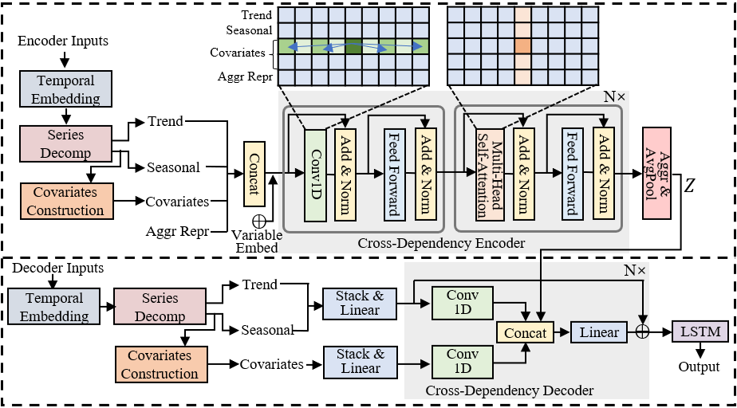

# CoRe: Transferable Long-range Time Series Forecasting Enhanced by Covariates-Guided Representation

<p align="center">

<br><br>
<b>Figure 1.</b> Overall CoRe Architecture.
</p>

Official PyTorch code repository for the [CoRe paper]().

* ETSformer is a novel time-series Transformer architecture which exploits the principle of exponential smoothing in improving
Transformers for timeseries forecasting.
* ETSformer is inspired by the classical exponential smoothing methods in
time-series forecasting, leveraging the novel exponential smoothing attention (ESA) and frequency attention (FA) to
replace the self-attention mechanism in vanilla Transformers, thus improving both accuracy and efficiency.

## Requirements

1. Install Python 3.8, and the required dependencies.
2. Required dependencies can be installed by: ```pip install -r requirements.txt```

## Data

* Pre-processed datasets can be downloaded from the following
  links, [Tsinghua Cloud](https://cloud.tsinghua.edu.cn/d/e1ccfff39ad541908bae/)
  or [Google Drive](https://drive.google.com/drive/folders/1ZOYpTUa82_jCcxIdTmyr0LXQfvaM9vIy?usp=sharing), as obtained
  from [Autoformer's](https://github.com/thuml/Autoformer) GitHub repository.
* Place the downloaded datasets into the `dataset/` folder, e.g. `dataset/ETT-small/ETTm2.csv`.

## Usage

1. Install the required dependencies.
2. Download data as above, and place them in the folder, `dataset/`.
3. Train the model. We provide the experiment scripts of all benchmarks under the folder `./scripts`,
   e.g. `./scripts/electricity.sh`. 

